# Nurse Salary Comparison Between States

## Motivation
This personal project was inspired by girlfriend who is an ICU nurse in NY. She shared with me a public excel file which shows the different salaries of nurses by different states. My girlfriend and I are currently long distance as she lives in NY and I live in CO. She said that the salaries are much lower in CO than in NY, which is a big detractor for the move. So being the engineer I am, I thought - what is the adjusted salary based on price index and state income taxes?! This is a comparison looking at just that! This program looks at the adjusted salaries between NY, NJ, and CO (both my girlfriend and I are from NJ, just acrossed from NY so I added this in as well).
 

## Implementation
The first thing that needed to be done, was I needed to see the correlation of the nurse salary data. While I could have done a multi-variable linear regression with the independant variables as years of experience, nursing depeartment, and regions based on location within the state - I chose to keep it relatively simple and just use years of experience by state. The draw back here is there are localities within each state that have different cost of living, salaries, and so forth, but the salaries and cost of living by state should average out using a least-squares regression for the most part.

 

## Cost of Living Adjustment
To get a better gauage on the adjusted salaries based on each state I first looked at normalizing salary based on the cost of living in eachs state. The metric used for this normalization was the cost of living index found from [Cost of Living](https://meric.mo.gov/data/cost-living-data-series). This metric compares the relatives costs in each state for groceries, housing, utilities, transportation, health, and a miscelaneous for averging other costs. This metric itself is normalized relative to a US based average which represent an index of 100. I then took this and scaled to make it a ratio to adjust the salaries by.

 

## State Income Tax Adjustment
A big talking point is the taxes that are paid in more densily populated states, particularly in the north east. While property tax and some others are already captured in the cost of living index already accounted for, state income tax was not. To normalized to state income tax, the effective rate is calculated relative to each salary and then a ratio is calculated relative to the a base state of Colorado such that it gets zero adjustment. Since we are taking colorado as the absolute to normalize to and effective income tax rates are in a percentage - we calculate the ratio as follows:

$$
    Ratio_{state} = 1 + (EffectiveTaxRate_{Colorado} - EffectiveTaxRate_{state})
$$

 

# Results:

First, it is important to get the correct model for the comparison to fit to. A simple linear regression shows that the R-value and F-test imply that the overall correlation is a good one and a linear relation does exist. A more complicated analysis would have been to add in higher polynomial terms and then do a log-likelyhood fit and to choose the the terms with the highest significance for the fit, but that was not neciisary here and overfitting could be a possible concern.
 

| 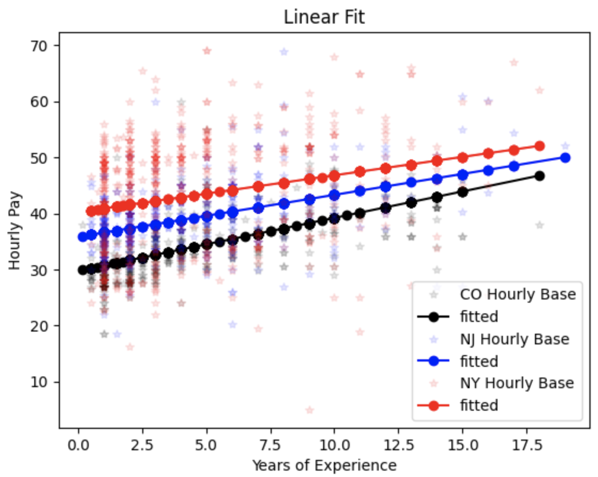  |   
|:----------------------------------:|
|Linear Fit - No Adjustments        |
 

| 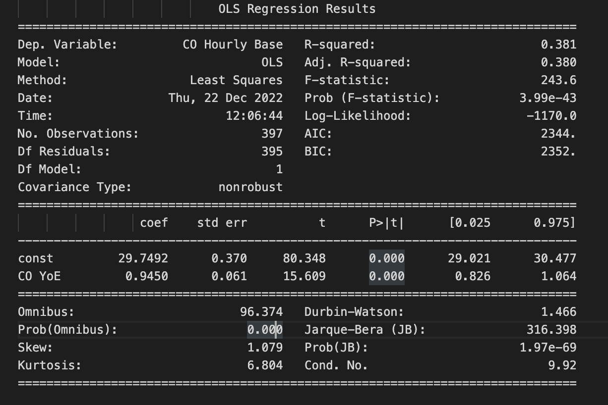  |   
|:----------------------------------:|
|Linear Fit Statistics        |
 

## Cost of living Adjustment
The cost of living adjustment had a large effect. Originally with no adjustments there was a pay gap that progressively shrinks with years of experience between NY, NJ, and CO, respectively. With the adjustment - all states have their salaries lowered as all states had a cost of living that was higher than the national average. The most expensive state to live in was NY, followed by NJ, and then CO. The best hourly pay by years of experience changed from NY for all years of experience to NJ being the best until roughly year 12.5. NY is the second best until roughly 2.5 years, where it then becomes increasingly the worst of the three states.
 

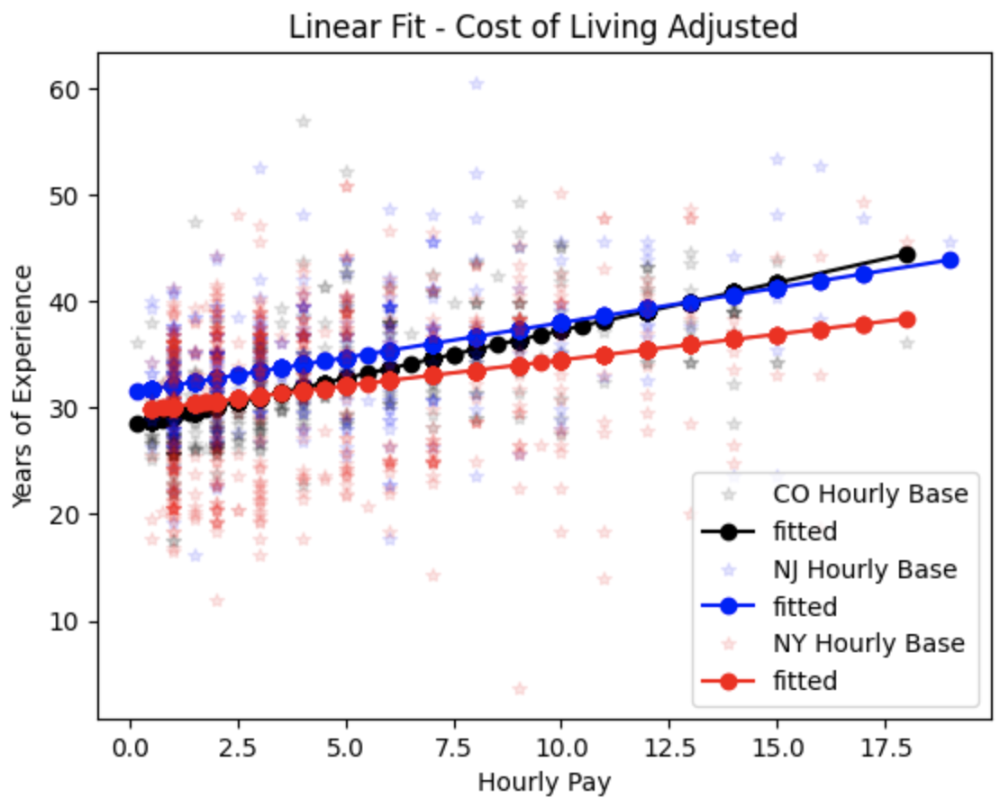
 

 ## Tax Adjustments
 Next, the state income tax adjustment was applied and the overall differences are almost not noticable. Additional plots to show the overall tax difference in terms of yearly salary and percent of yearly pay were provided to show that this is true becuase the average pay for a nurse ranges from 50-115 thousand dollars a year, where the difference in tax brackets only ranges from about (-2% to 1%) which is atmost roughly 50 cents an hour!
  

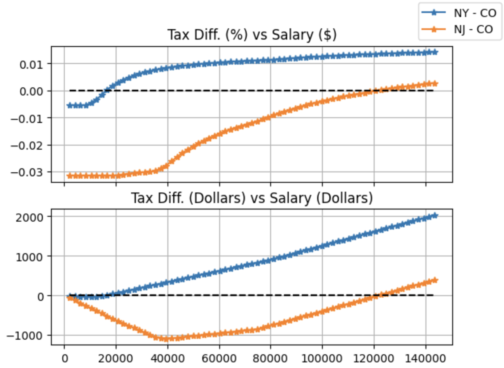
 

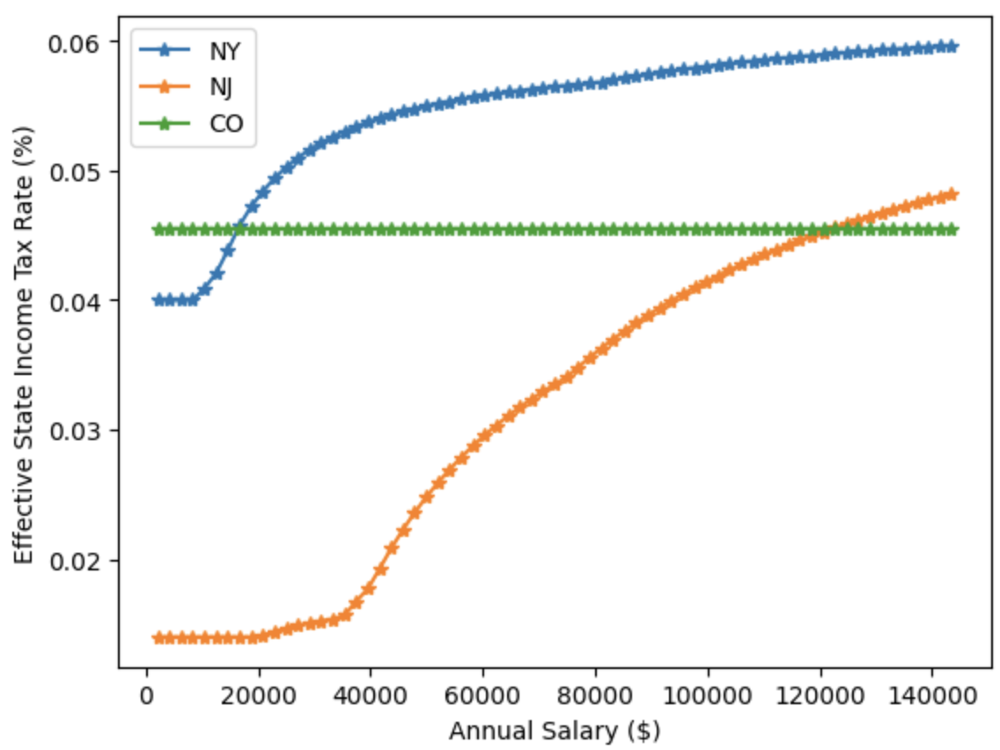
 

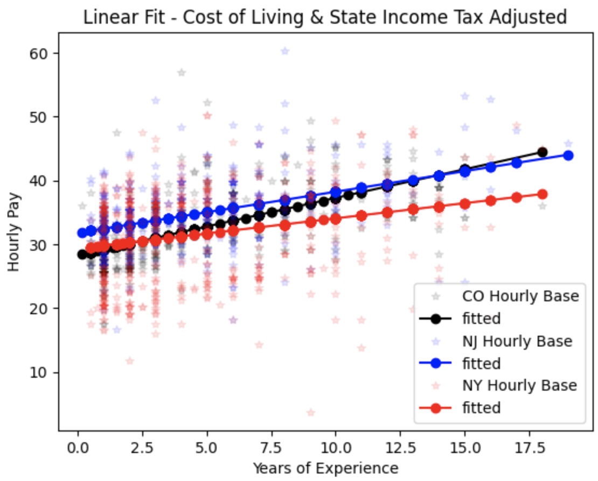
 

## Whole Picture
As a whole - the adjustments for the cost of living swayed the best hourly pay quite a bit. The effect of state income tax was marginal and only effected when each state was best relative to years of experience. With both adjustments, the best state for hourly pay is NJ for years of experience from 1 to ~14 years. The second best state is NY for years 1 to ~2.5, where CO then is the second best from this ~2.5 years of experience up until ~14 years of experience, where it then becomes the best. 
 

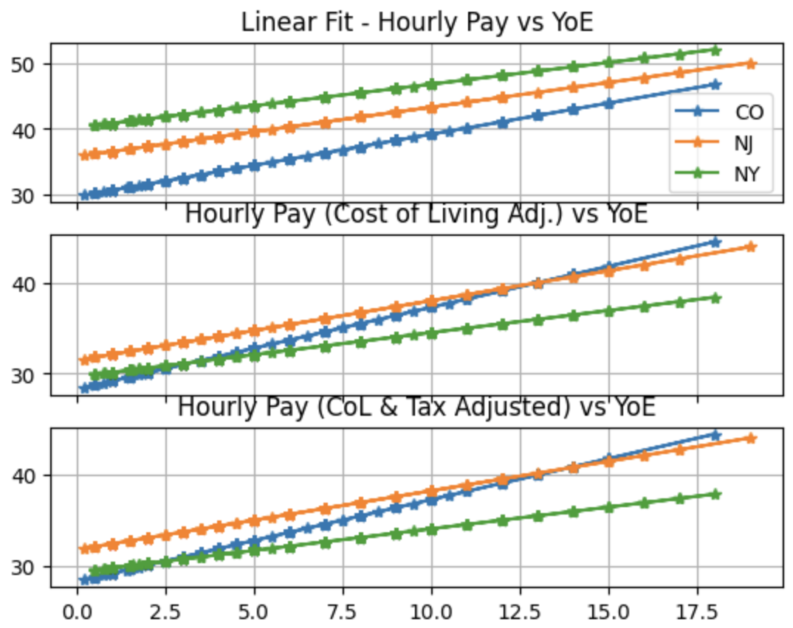
 

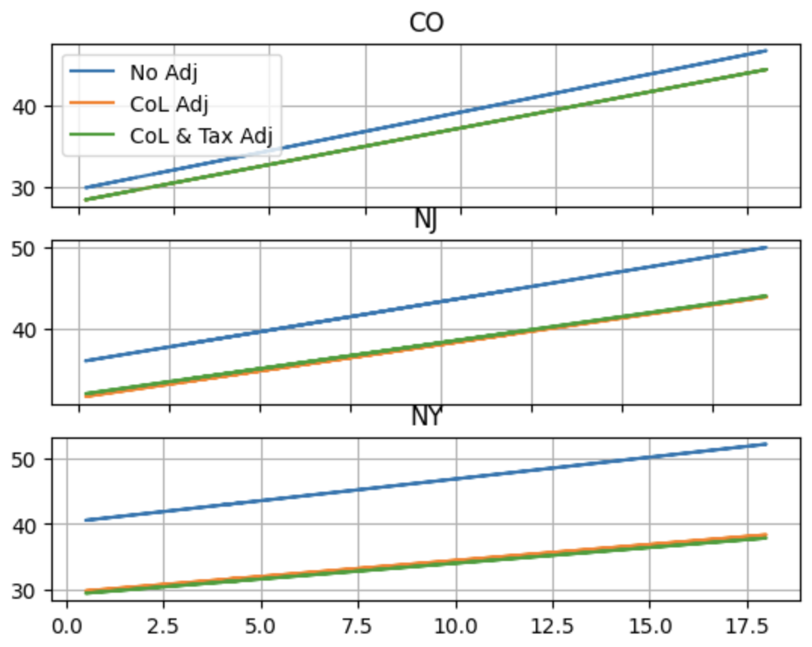
 

Another factor pertinent to the senario between my girlfriend and I is that we are considering the next few years. Since my girld friend is a new grad that just started - I applied a filter to look at the distributions of salaries for years of experience in the 1-3 year range. I included the distribution, the kernal density distribution (which essentially makes the distribution continuous with the assumption they are guassian), and the means/medians. This data is really just a slice of the fit graph where the LSE is just the mean. Whar can be seen is that NY's distribution is bi-modal, which indicated that the assumption that regional effects on salary being negligiable was probably not a good one as regions near the NYC metro seem to pay higher than the second mode which is likely representing rural areas. This is just an assumption, the effects could be from division in the hisptial such as ICU paying more than ER, and this can of course be figured out, however I will leave that as a TODO for now!
 

| 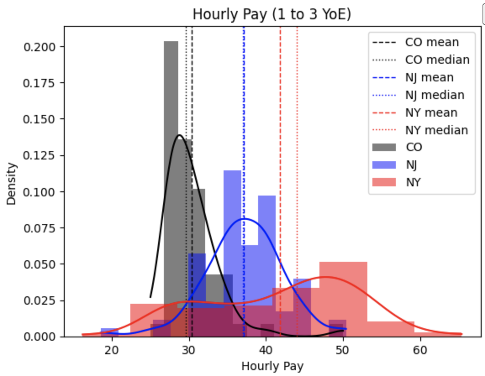 |
|:----------------------------------:|
| 1 to 3 Years of Experience - No Adjustments    |
 

|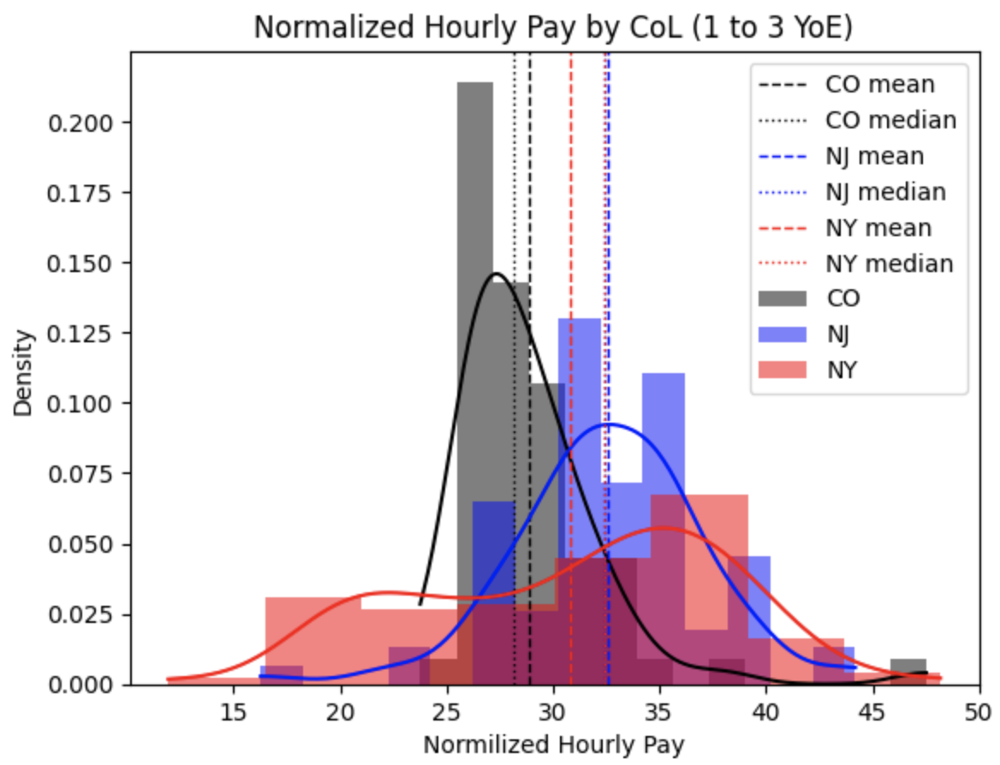|
|:----------------------------------:|
| 1 to 3 Years of Experience - Cost of Living Adjusted    |
 

|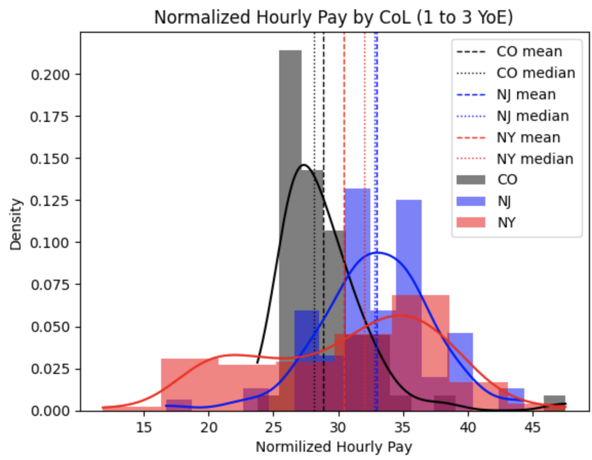|
|:----------------------------------:|
| 1 to 3 Years of Experience - Cost of Living & State Income Tax Adjusted   |
 